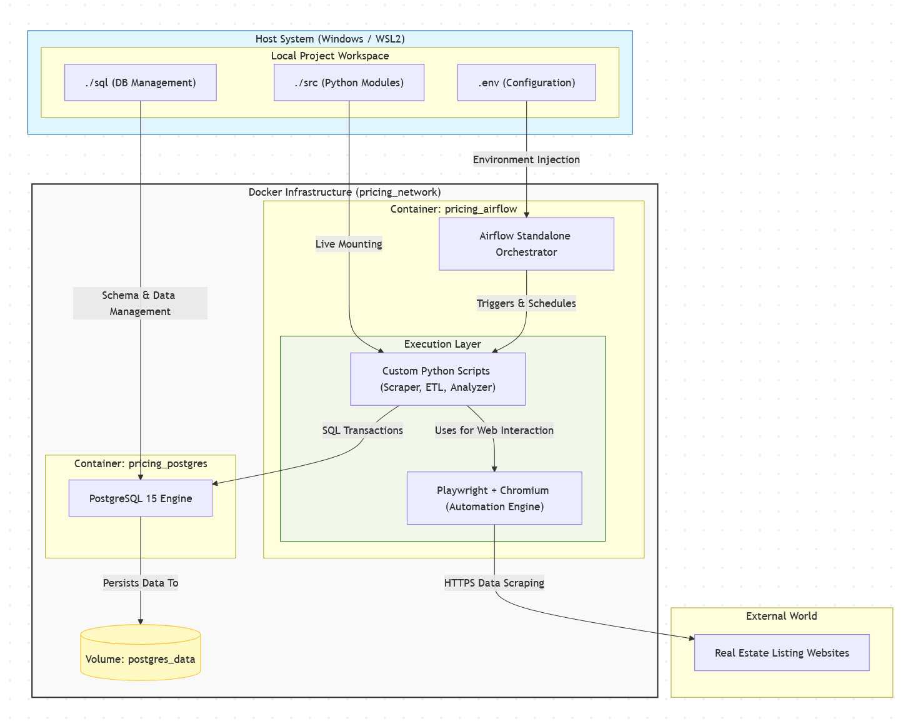
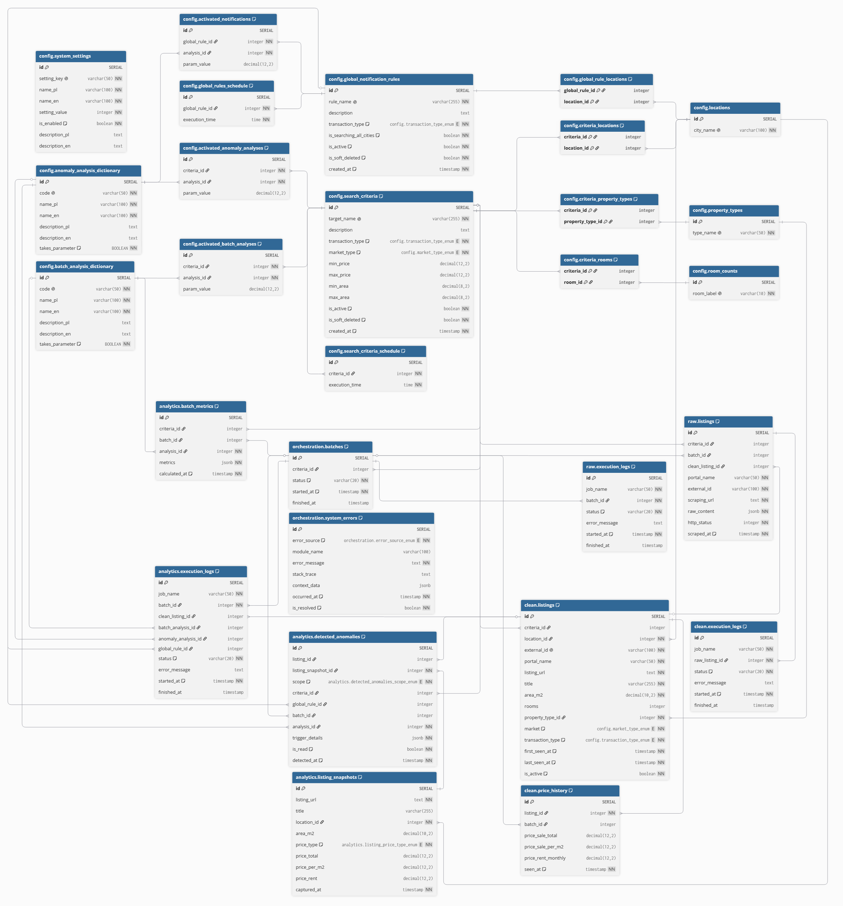
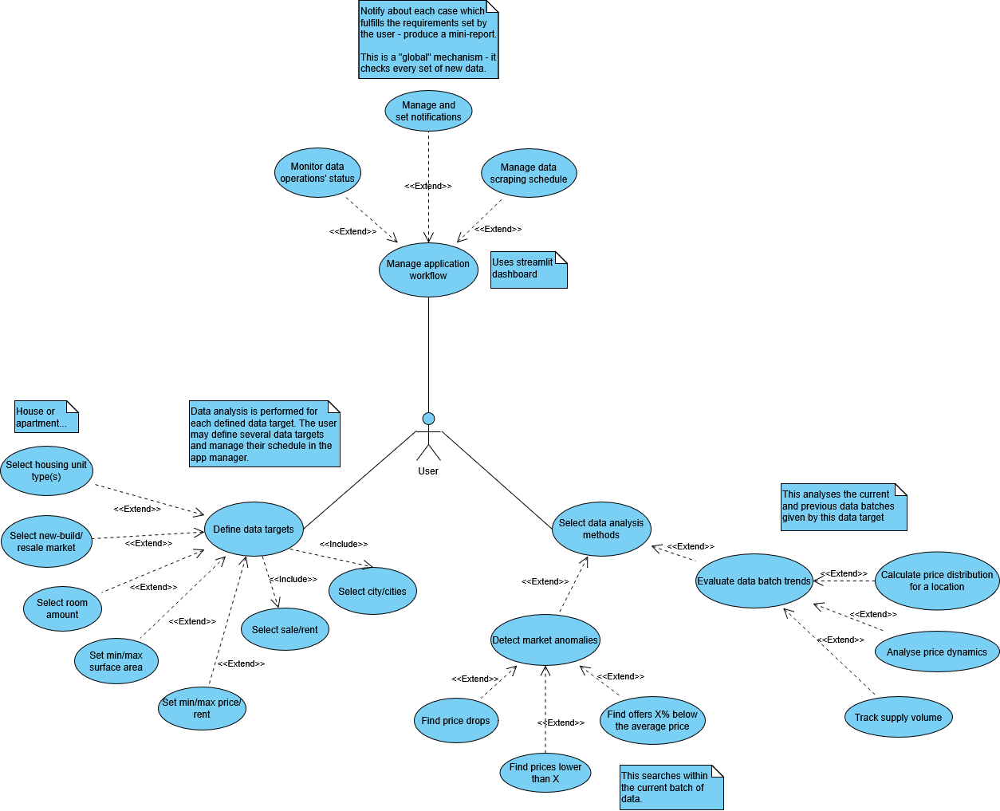
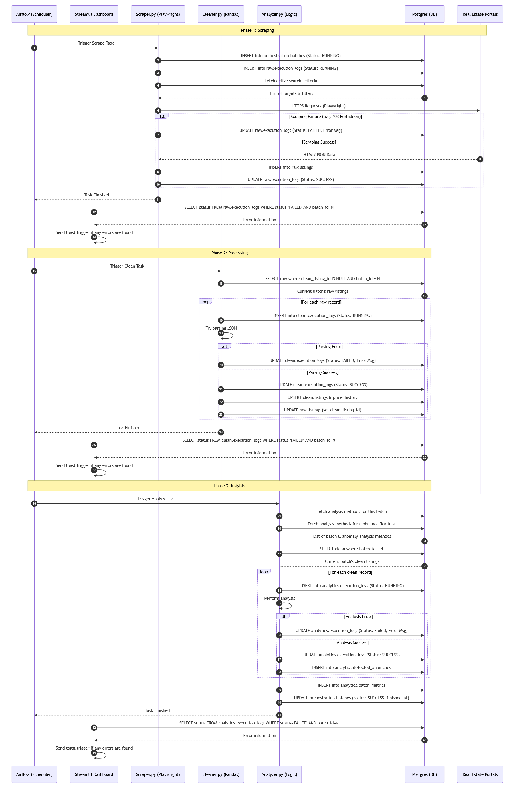
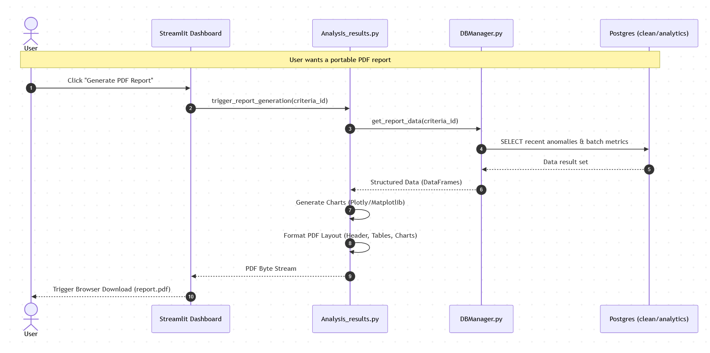
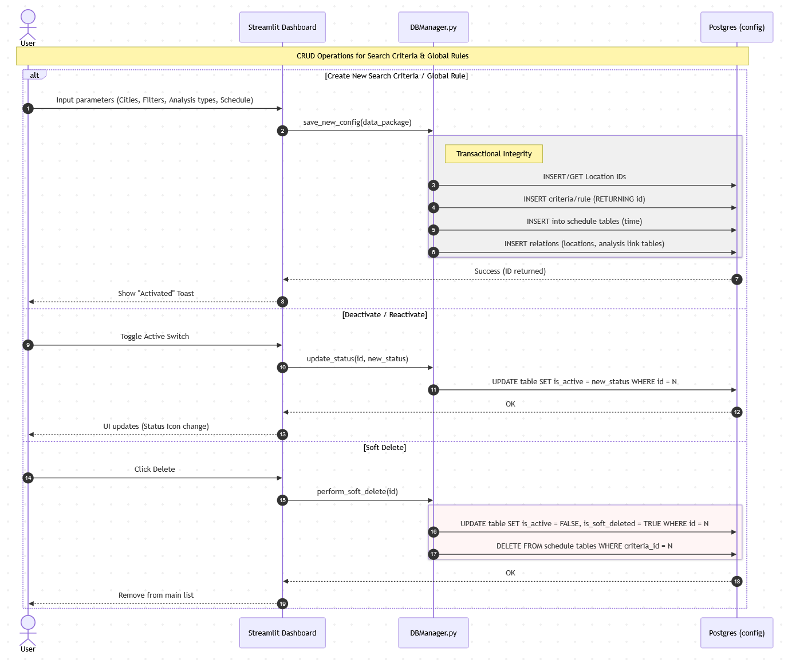
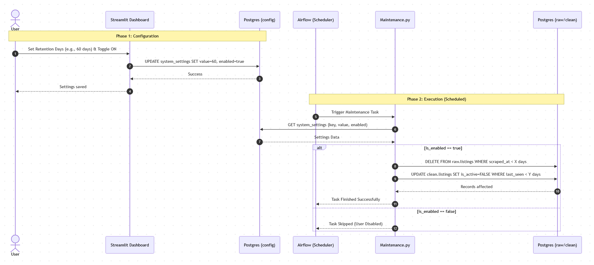
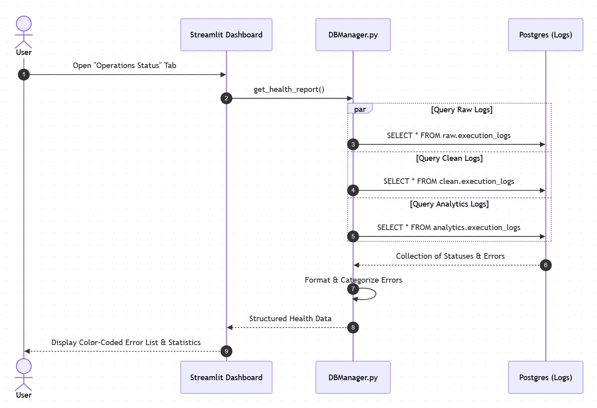

# 🏙️ Real Estate Pricing Analytics Platform

An End-to-End Data Engineering platform designed to automate the collection, processing, and analysis of real estate market trends. This project demonstrates a production-ready data lifecycle—from raw web scraping to statistical insights.


---

# Application Showcase:  
[](https://res.cloudinary.com/v2wiqxbn/video/upload/v1788128384/showcase.mp4)

## 🌟 Key Features

*   **🤖 Advanced Automation**: Distributed scraping powered by **Playwright & Stealth**, orchestrated by **Apache Airflow**. Features automated IP rotation via **ProtonVPN (Gluetun Gateway)** to ensure continuous data flow.
*   **📊 Intelligent Analytics**: 
    *   **Micro-scale**: Anomaly detection (Price Drops, Market Outliers).
    *   **Macro-scale**: Market dynamics tracking (Medians, Averages, Supply Volume).
    *   **Statistical Analysis**: Price distribution histograms using **NumPy** for dynamic binning.
*   **🛡️ Robust Engineering**:
    *   **Medallion Architecture**: Organized data layers: **Bronze** (Raw JSON), **Silver** (Cleaned/Deduplicated), and **Gold** (Analytics/Insights).
    *   **Data Integrity**: Implementation of **SCD Type 2** logic to track property history without losing historical context.
    *   **Operational Health**: Centralized logging of system errors and execution statuses.

---

## 🏗️ System Architecture & Design

### 1. Core Infrastructure & Data Model
*   **System Architecture (SAD)**: Fully containerized environment isolating the Database, Orchestrator, VPN Gateway, and Dashboard.
    
*   **Relational Data Model (ERD)**: Schema supporting multi-language dictionaries and point-in-time listing snapshots.
    

### 2. Logic & Use Cases
*   **Application Use Cases (UCD)**: Initial project goals defined by what service it ought to provide to the end user.
    
*   **End-to-End Data Pipeline**: Visual flow of how raw JSON data transforms into actionable insights through Ingestion, Cleaning, and Analysis phases.
    

### 3. Functional Workflows (Sequence Diagrams)
*   **Export Analytics to PDF**: Process of gathering batch results and generating portable, easy-to-understand reports.
    
*   **Application Action Management**: User interaction for creating, editing, and performing soft-deletes on search targets.
    
*   **Database Maintenance**: Automated cleanup operations based on user-defined retention policies.
    
*   **Operations Status Monitoring**: Real-time health checking and error reporting within the dashboard.
    

---

## 🛠️ Tech Stack

| Layer | Technologies |
| :--- | :--- |
| **Languages** | Python 3.11, SQL (PostgreSQL Dialect) |
| **Database** | PostgreSQL 15, SQLAlchemy (ORM) |
| **Orchestration** | Apache Airflow 2.9 |
| **Data Processing** | Pandas, NumPy |
| **Scraping** | Playwright, Playwright-Stealth |
| **Infrastructure** | Docker, Docker Compose, Gluetun (VPN Gateway) |
| **Quality** | Pytest (Unit & Logic Testing) |
| **Reporting** | Streamlit, FPDF2 (PDF Engine) |

---

## 🚀 Getting Started

### Prerequisites
*   Docker & Docker Compose
*   ProtonVPN Account (for WireGuard credentials)

### Installation
1.  **Clone the repository**:
    ```bash
    git clone https://github.com/YOUR_USERNAME/pricing-intelligence-platform.git
    cd pricing-intelligence-platform
    ```
2.  **Configure Environment**:
    Create a `.env` file in the root directory and fill in your credentials:
    ```env
    POSTGRES_USER=admin
    POSTGRES_PASSWORD=your_secure_password
    POSTGRES_DB=pricing_db
    PROTON_WIREGUARD_KEY=your_private_key
    AIRFLOW_ADMIN_USER=admin
    AIRFLOW_ADMIN_PASSWORD=your_secure_password
    ```
3.  **Launch the Platform**:
    ```bash
    docker-compose up -d --build
    ```
4.  **Access the Dashboard**:
    Open `http://localhost:8501` to manage search criteria and view results.

---

## 🧪 Testing
The project uses **Pytest** to ensure logic integrity. 
To run tests locally:
```bash
pytest
```

## ⚖️ Copyright & Usage

This project was created solely for my professional portfolio and demonstration purposes. All rights reserved. No part of this repository may be used, redistributed, or modified without my explicit permission.
